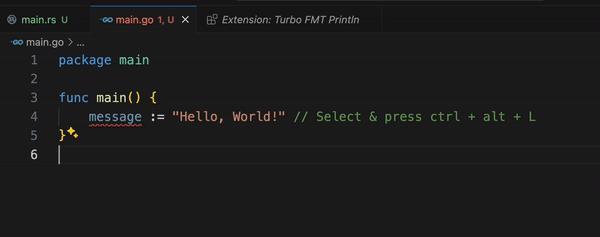

## Main Functionality

---

This extension make debugging much easier by automating the operation of writing meaningful log message.

Inspired from : https://github.com/Chakroun-Anas/turbo-console-log

## Features

---

I) Insert meaningful log message automatically

Two steps:

- Selecting the variable which is the subject of the debugging

- Pressing ctrl + alt + L

The log message will be inserted in the next line relative to the selected variable like this:

fmt.Println("SelectedVariableEnclosingClassName -> SelectedVariableEnclosingFunctionName -> SelectedVariable", SelectedVariable)

 

Multiple cursor supported.

Properties: It still uses gofmt for settings will be replaced in future.

- gofmt.wrapLogMessage (boolean): Whether to wrap the log message or not.

- gofmt.logMessagePrefix (string): The prefix of the log message (default one is 🚀 ).

- gofmt.addSemicolonInTheEnd (boolean): Whether to put a semicolon in the end of the log message or not.

- gofmt.insertEnclosingClass (boolean): Whether to insert or not the enclosing class of the selected variable in the log message.

- gofmt.insertEnclosingFunction (boolean): Whether to insert or not the enclosing function of the selected variable in the log message.

- gofmt.delemiterInsideMessage (string): The delimiter that will separate the different log message elements (file name, line number, class, function and variable)

- gofmt.includeFileNameAndLineNum (boolean): Whether to include the file name and the line number of the log message.

- gofmt.quote (enum): Double quotes (""), single quotes ('') or backtick(``).

## Participate

---

You're more than welcome to participate in the development of the extension by creating pull requests and submitting issues, link of the project in github: https://github.com/sachinsmc/GO-FMT

## License
MIT
---
Credit : https://github.com/Chakroun-Anas
---

**Enjoy!**
